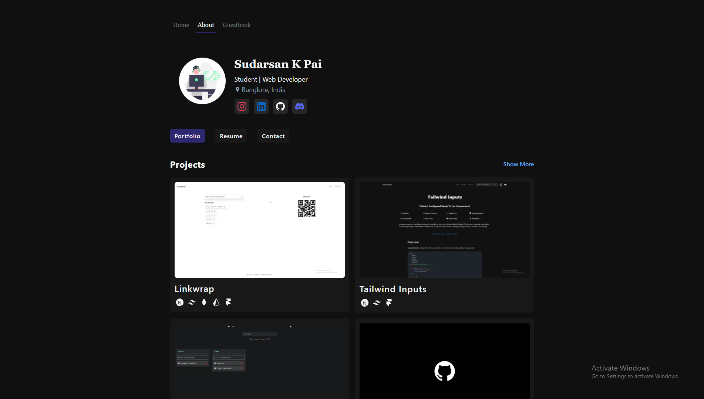

[Preview](https://k8pai.dev)



## Overview

This repository contains the source code for my personal portfolio website. It showcases my skills, projects, and experiences in web development. The website is built using the following technologies:

-   Next.js
-   NextAuth.js
-   Prisma
-   MongoDB
-   Framer Motion
-   Tailwind CSS
-   TypeScript
-   Contentlayer


## Features

-   Responsive design for various screen sizes
-   Project showcase with detailed descriptions
-   Contact form for inquiries and feedback

## Getting Started

### Prerequisites

-   [Node.js](https://nodejs.org/) installed
-   [npm](https://www.npmjs.com/) package manager

### Installation

1. Clone the repository:

    ```bash
    git clone https://github.com/k8pai/k8pai.dev.git
    ```

2. Navigate to the project directory:
    ```bash
    cd k8pai.dev
    ```
3. Install dependencies:
    ```bash
    npm install
    ```

## Usage

1. Start the development server:
    ```bash
    npm run dev
    ```
2. Open your web browser and go to `http://localhost:3000` to view the website locally.

## Folder Structure

```
|-- app/
	|-- about
	|-- guestbook
	|-- secret
	|-- solutions/
	|-- page.tsx
	|-- ...
|-- components/
	|-- Footer.tsx
	|-- Header.tsx
	|-- Logo.tsx
	|-- ProjectCard.tsx
	|-- ...
|-- lib/
	|-- helper.ts
	|-- nodemailer.js
	|-- schema.ts
	|-- ...
|-- pages/
	|-- api/
		|-- auth/
			|-- [...nextauth].ts
		|-- contact.ts
		|-- guestbook.ts
		|-- interactions.ts
	|-- ...
|-- prisma/
	|-- schema.prisma
|-- public/
    |-- Resume_k8pai.pdf
    |-- ...
|-- .env.local
|-- contentlayer.config.js
|-- next.config.js
|-- package.json
|-- tailwind.config.js
|-- tsconfig.json
|-- ...
```

## Customization

-   Replace `screenshot.png` with a screenshot of your website.
-   Modify the content in `pages/api` to add your own api endpoints.
-   Update your Stylings with [tailwindcss](https://tailwindcss.com/docs/installation) utility classnames in each pages in `app/*` folder to match your design preferences.

## Deployment

To deploy your website, you can use platforms like [Vercel](https://vercel.com/). Follow their respective documentation for detailed instructions.

## Contributing

If you'd like to contribute, please fork the repository and create a pull request. You can also open an issue for bug reports or feature requests.

## License

This project is licensed under the [MIT License](LICENSE).

## Acknowledgements

-   [Next.js](https://nextjs.org/)
-   [NextAuth.js](https://next-auth.js.org/)
-   [Prisma](https://www.prisma.io/)
-   [MongoDB](https://www.mongodb.com/)
-   [Framer Motion](https://www.framer.com/motion/)
-   [Tailwind CSS](https://tailwindcss.com/)
-   [TypeScript](https://www.typescriptlang.org/)
-   [Contentlayer](https://contentlayer.dev/)
-   [svg path editor](https://yqnn.github.io/svg-path-editor/)
